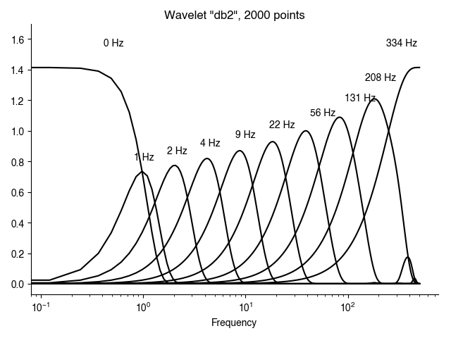
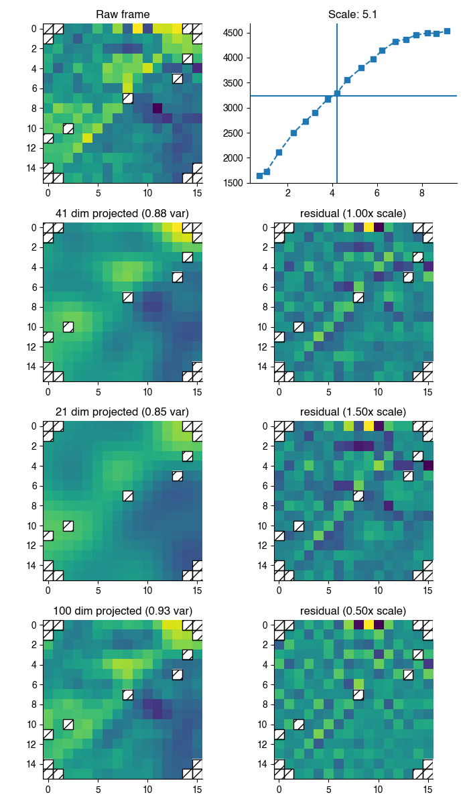
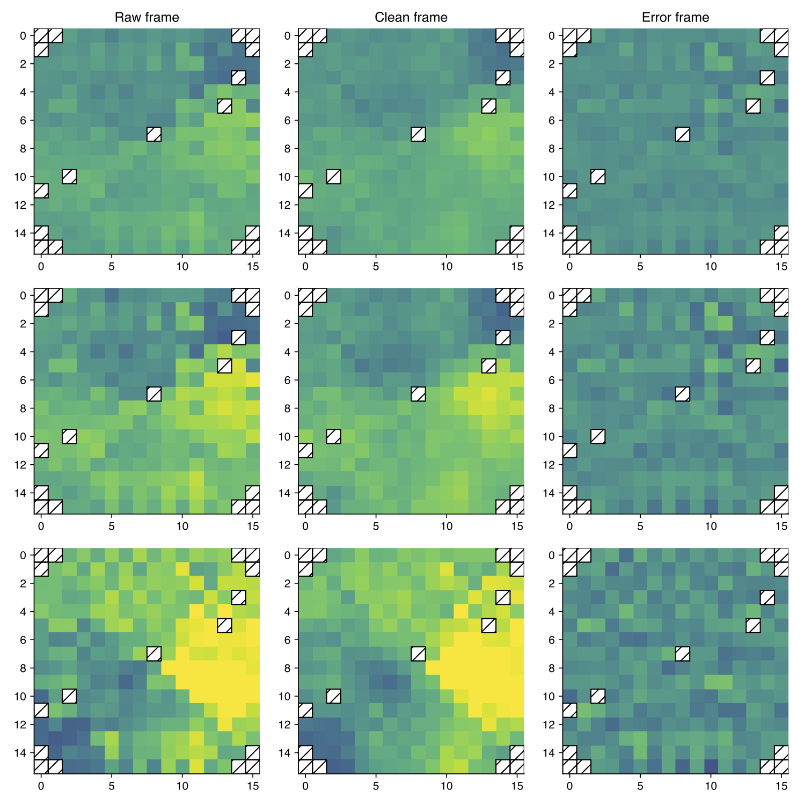
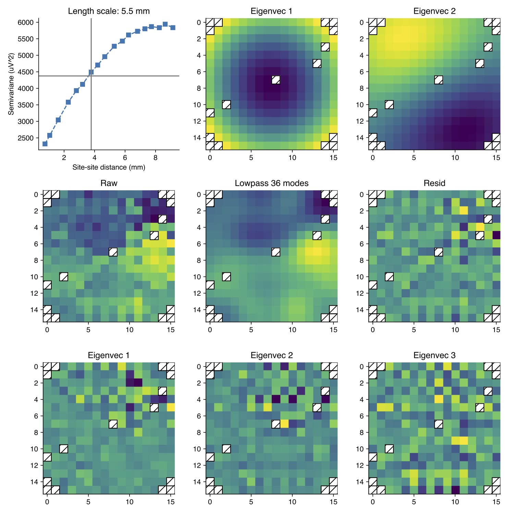

# Structure-denoising tool for 244-channel ECoG array

This set of code performs artifact subtraction for the peculiar noise "structure" seen in the 244 channel LCP ECoG array. The algorithm is described in a notebook named "Structure_denoise_notes". There is also an extensive library of methods to visualize and predict the effects of processing parameters, which can be used to tweak processing for a particular recording.

## October 2020 update for posterity

The "structured artifacts" observed were caused by an error in channel mapping. This tool is no longer of use.

## Installing

This code has been tested for Python 2 and Python 3.

1. Set up a python installation (also see note below regarding writing h264 files through Python)

I recommend [pyenv](https://github.com/pyenv/pyenv) in conjunction with [pyenv-virtual-env](https://github.com/pyenv/pyenv-virtualenv) on mac or linux, described in the following steps. But conda (described after) is a "batteries-included" option that could be more convenient for any OS.

```
$ pyenv install [pythonversion, e.g. 2.7.14]
$ pyenv virtualenv 2.7.14 denoise_py2
$ pyenv activate denoise_py2
```

For windows specifically, there is a plain install, with system environment settings described [here](https://anthonydebarros.com/2018/06/21/setting-up-python-in-windows-10/).

Alternatively, I have used miniconda detailed [here](https://conda.io/docs/user-guide/install/windows.html), mostly with success. A working environment can be installed using `conda` like this from the Anaconda Prompt application, or a terminal in mac/linux:

```
conda create -c conda-forge -n denoise-env --file=conda-packages.txt
conda activate denoise-env
pip install mat4py
```

Then proceed to these steps.

2. git-clone this repo: `git clone https://github.com/miketrumpis/structure_denoise.git`
2. If *not* using conda, pip-install requirements: `pip install -r requirements.txt`
2. pip-install this package: `pip install .`

**Note 1: the instructions here have installed software into virtual environments. These need to be re-activated any time the software will be used.**

**Note 2: you may need to pip-install a graphics backend to enable plotting
(e.g. `pip install pyqt5` on python 3).**

**Note 3: video writing requires separate codec software, most likely "ffmpeg". This can be installed by hand and its path entered into the "matplotlibrc" settings file. Perhaps easier is to install it using the conda system, per the `conda-packages.txt` file**

## Command-line interface
The driver script (`driver.py`) is an interface to the code base that can be run in multiple modes that steer usage. The full list of options is printed here. Due to the complexity of options, arguments pertaining to different run-modes can be written in individual files and then combined to perform the desired mode(s). For example, the driver script can be run with this syntax (*with the "@" symbol processing the file name*) to plug in options for the plot-wavelets-mode

```
$ driver.py @wavelet-mode-args.txt
```

These sections will be described subsequently.

```
usage: driver.py [-h] [--data-source DATA_SOURCE] [--source-type SOURCE_TYPE]
                 [--exclude-channels EXCLUDE_CHANNELS [EXCLUDE_CHANNELS ...]]
                 [--save-mod SAVE_MOD] [--reraise] [--multiresolution]
                 [--wavelet-name WAVELET_NAME] [--block-size BLOCK_SIZE]
                 [--model-var MODEL_VAR] [--resid-var RESID_VAR]
                 [--length-scale-bias LENGTH_SCALE_BIAS]
                 [--min-resid-rank MIN_RESID_RANK]
                 [--max-image-rank MAX_IMAGE_RANK] [--diagnostic-mode]
                 [--diagnostic-wavelet-level DIAGNOSTIC_WAVELET_LEVEL]
                 [--diagnostic-skip-video] [--plot-wavelet-mode]
                 [--wavelet-length WAVELET_LENGTH]
                 [--wavelet-samp-rate WAVELET_SAMP_RATE]
                 [--plot-projection-mode]
                 [--projection-wave-level PROJECTION_WAVE_LEVEL]
                 [--projection-deviation PROJECTION_DEVIATION]
                 [--projection-frame-start PROJECTION_FRAME_START]

Structure denoising command-line-interface

optional arguments:
  -h, --help            show this help message and exit
  --data-source DATA_SOURCE
                        Path to data resource
  --source-type SOURCE_TYPE
                        pesaran, open ephys, ...
  --exclude-channels EXCLUDE_CHANNELS [EXCLUDE_CHANNELS ...]
                        Drop these channels from the array
  --save-mod SAVE_MOD   Modifier name for cleaned file
  --reraise
  --multiresolution     Denoise wavelet scales
  --wavelet-name WAVELET_NAME
                        PyWavelets wavelet name
  --block-size BLOCK_SIZE
                        Processing block size in seconds
  --model-var MODEL_VAR
                        Model covariance proportion
  --resid-var RESID_VAR
                        Noise covariance proportion
  --length-scale-bias LENGTH_SCALE_BIAS
                        Bias length scale estimates
  --min-resid-rank MIN_RESID_RANK
                        Minimum dimension of noise space
  --max-image-rank MAX_IMAGE_RANK
                        Maximum dimension of image space
  --diagnostic-mode     Make diagnostic plots for current settings
  --diagnostic-wavelet-level DIAGNOSTIC_WAVELET_LEVEL
                        Wavelet level (or "all") for diagnostics (not
                        applicable if multiresolution is not set)
  --diagnostic-skip-video
                        Skip (time consuming) video writing
  --plot-wavelet-mode   Plot wavelet bands
  --wavelet-length WAVELET_LENGTH
                        Sequence length for wavelet decomp
  --wavelet-samp-rate WAVELET_SAMP_RATE
                        Sampling rate
  --plot-projection-mode
                        Demo image space projection
  --projection-wave-level PROJECTION_WAVE_LEVEL
                        Use this wavelet scale level
  --projection-deviation PROJECTION_DEVIATION
                        Show length scale deviation
  --projection-frame-start PROJECTION_FRAME_START
                        Start frames here (-1 for random)
```

## Data source options
Here is an example of a file describing how to load a data source. It would be useful to keep a separate file describing each dataset.

```
$ cat data-source-args.txt
# path to the base of the dataset
--data-source=/Users/mike/experiment_data/180222_goose/002

# "type" of source (currently pesaran or open ephys)
--source-type=pesaran

# a list of channels to be dropped from analysis (due to recording snafu)
--exclude-channels 66 71 195

# if denoising the dataset, then an output file will be created with this modifier (default "clean")
--save-mod=multires-clean
```

## Processing options
Denoising is calculated on short time batches. The processing options are split between two parts: how to batch and preprocess batches, and the algorithm parameters themselves.

The batch processing arguments are

```
$ cat proc-args.txt
# --- Batch arguments ---

# If this argument is present, operate on wavelet subbands...
--multiresolution

# ...with this wavelet
--wavelet-name=db2

# This is the size of the short time batch in seconds
--block-size=0.5

# --- Method arguments ---

# Use a minimum of 3 dimensions for the noise projection
--min-resid-rank=3

# Bias the length scale estimates by -1 mm
--length-scale-bias=-1

# Other parameters:
#--model-var=0.95
#--resid-var=0.9
#--max-image-rank=80
```

### Driving a batch artifact subtraction
Running the denoising in prime time can be done by concatenating a data source and processing arguments:

```
$ driver.py @data-source-args.txt @proc-args.txt --process-mode
```

Alternatively, those three arguments can be placed into another text file.

"Pesaran" style data sources use the "LFP" data block, resampled at 1 kS/s. The same kind of file (in the same channel order) is saved out.

"Open ephys" style data sources use a resampled set of channels in an HDF5 file, which includes at 4 x 64 ADC channels. The denoised array vectors are re-mapped to the original acquisition order.

**Currently any discarded or non-array channels are zeroed out, rather than preserved.**

## Plot wavelets mode
This is a stand-alone mode to visualize the wavelet frequency bands.

```
$ cat wavelet-mode-args.txt
# This argument turns on wavelet mode
--plot-wavelet-mode

# Use this wavelet name (from PyWavelets)
--wavelet-name=db2

# Data block length
--wavelet-length=2000

# Sampling frequency
--wavelet-samp-rate=1000
```

Running

```
$ driver.py @wavelet-mode-args.txt
```

results in this image



## Image-space projection demo mode
This mode demonstrates the first stage of the artifact estimation, which is a projection of the ECoG frame to a model image space. This mode requires both a data source and processing parameters, which are linked within the file using the same "@" symbol.

```
$ cat projection-plots-args.txt
# Turn on projection mode
--plot-projection-mode

# Look at this wavelet level (wavelet specified in processing args, or defaulted)
--projection-wave-level=4

# Compare projections at length scales +/- 0.5 mm
--projection-deviation=0.5

# Demo with a block starting at this time in seconds (otherwise use a random block)
--projection-frame-start=30

# link in data
@data-source-args.txt

# link in processing specs
@proc-args.txt
```

Running

```
$ driver.py @projection-mode-args.txt
```

results in this image



## Diagnostics mode
In this mode, a single data block is denoised and various diagnostic images are created, along with a video showing the raw, cleaned, and residual frames in left-to-right order. This mode can be used to predict the quality of denoising for the current method settings. Plots and videos are saved in a timestamped subdirectory under `diagnostic_plots`, which is created in the present directory.

```
$ cat diagnostic-mode-args.txt
--diagnostic-mode

# Show plots for a single wavelet level (enter a number), or all levels
--diagnostic-wavelet-level=all

# If present, skip writing videos
# --diagnostic-skip-video

# this mode also needs a data source and processing parameters
@data-source-args.txt
@proc-args.txt
```

Running
```
$ driver.py @diagnostic-mode-args.txt
```

results in images such as these, shown for wavelet level 3



